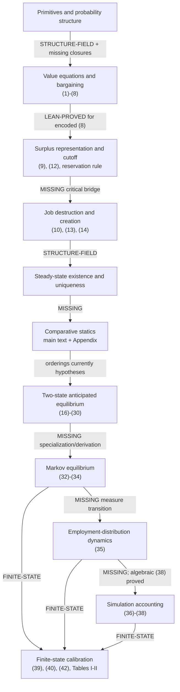
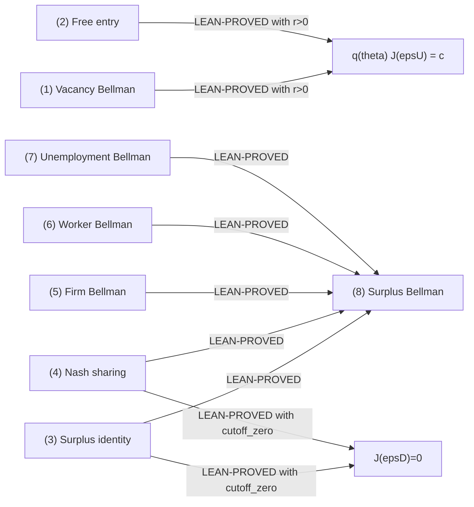
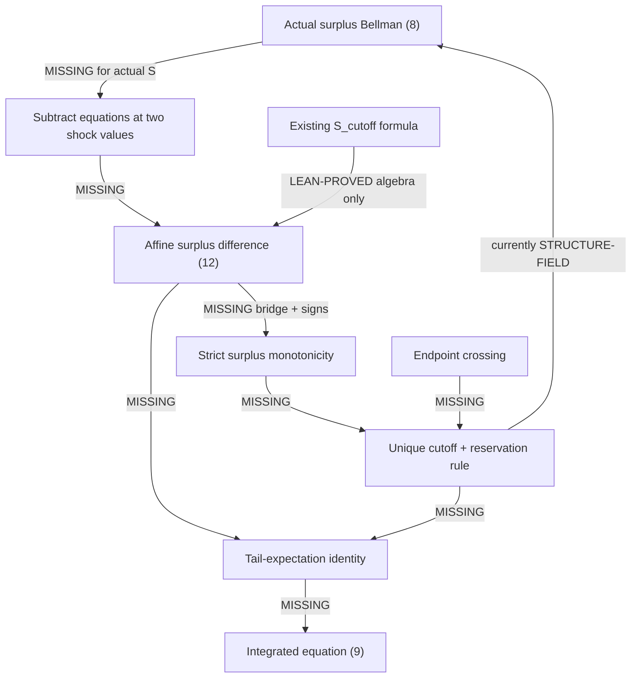
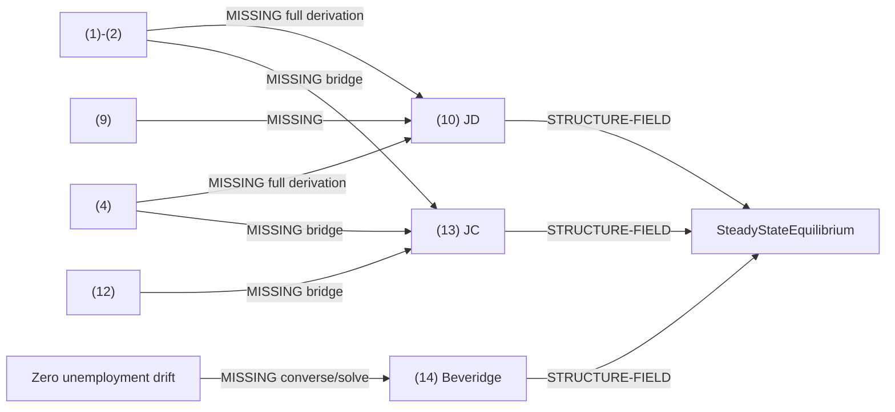
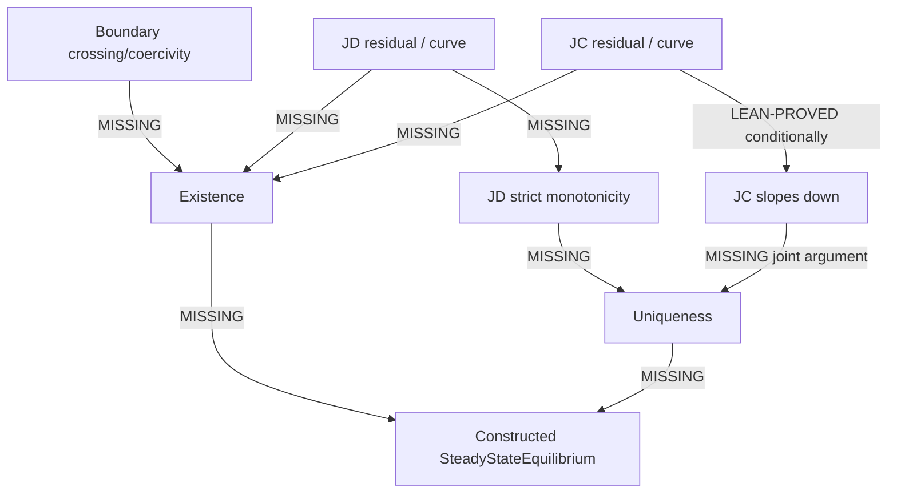
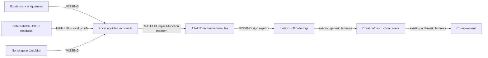
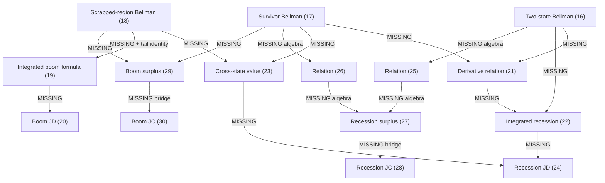
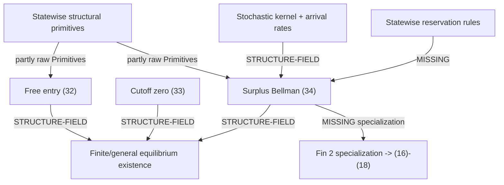
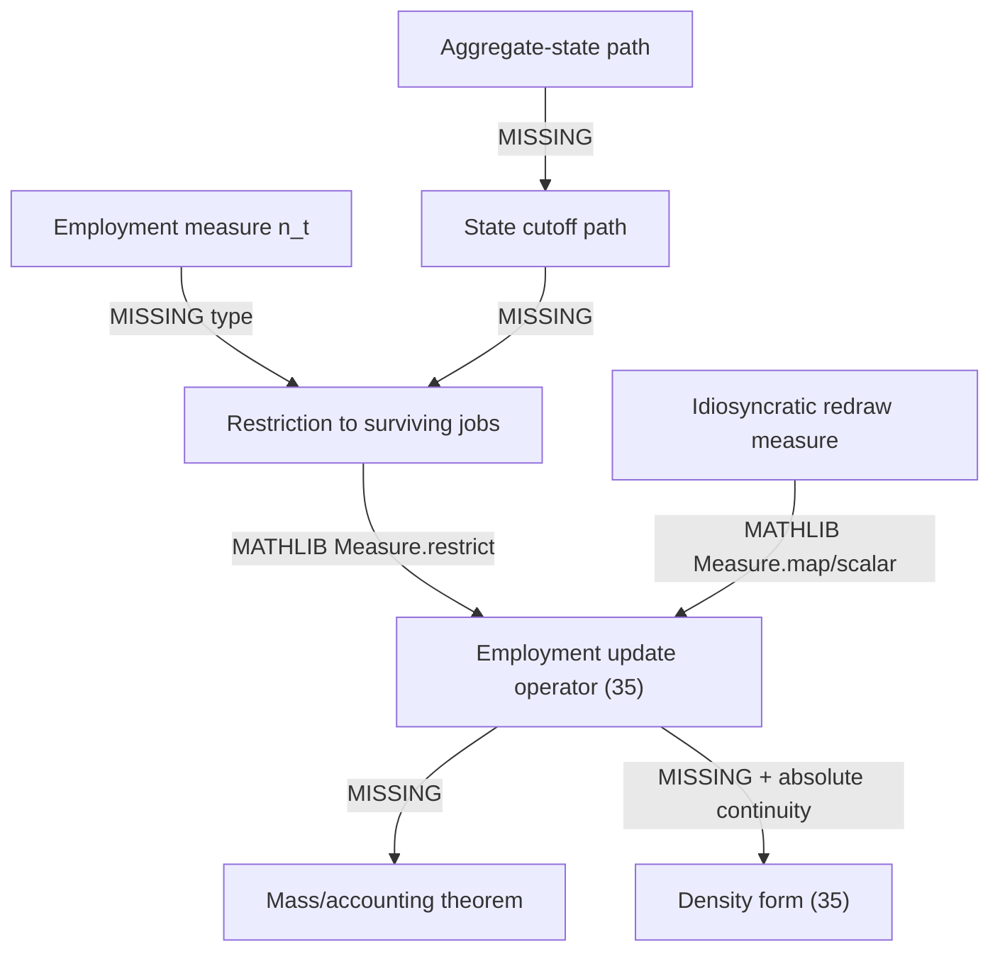

# MP1994 Mathematical Dependency Graph

Repository root: `/Users/davidxu/Documents/lean4tutorial`

Edge labels:

- **LEAN-PROVED**: an existing Lean theorem establishes the edge.
- **STRUCTURE-FIELD**: the target fact is supplied when constructing a record.
- **THEOREM-HYPOTHESIS**: the target fact is supplied directly to a theorem.
- **MATHLIB**: standard imported mathematics can provide the edge.
- **MISSING**: the mathematical dependency has not been formalized.
- **FINITE-STATE**: the edge is specific to a concrete finite witness/calibration.

## 1. High-level graph



The graph's critical break is the edge from actual value surplus to the closed-form
surplus/cutoff representation. `S_cutoff` exists as a parallel definition
(`Lean4Tutorial/i002_replicate_MP/Definitions.lean:84-86`), but no theorem identifies it
with `ValueEquilibrium.S` (`Lean4Tutorial/i002_replicate_MP/Equilibrium.lean:18-49`).

## 2. Primitives and probability structure

### Nodes

- `Primitives`: raw scalars, measure, and meeting function
  (`Lean4Tutorial/i002_replicate_MP/Definitions.lean:21-43`).
- `Assumptions`: signs, mass/support, CDF bounds/monotonicity, and weak matching
  monotonicity (`Lean4Tutorial/i002_replicate_MP/Definitions.lean:251-280`).
- Missing paper law: atomless probability, mean zero, variance one, moment/integrability
  conditions.
- Missing matching technology: strict decrease, differentiability, and elasticity
  restriction.

### Edge ledger

| From | To | Label | Evidence / missing result |
|---|---|---|---|
| `dF` as `Measure ℝ` | `F` | Existing definition | `Primitives.F`, `Definitions.lean:48-50`. |
| Probability mass | `0≤F≤1`, monotone `F` | Currently **STRUCTURE-FIELD**; should be **MATHLIB/LEAN-PROVED** | Fields `Definitions.lean:265-274`; derive using measure monotonicity. |
| No atoms | cutoff endpoint equivalence | **MISSING** | Needed because hazard uses `Iic` (`Definitions.lean:48-50`, `Definitions.lean:80-82`) while cutoff is weakly acceptable (`Equilibrium.lean:48-49`). |
| Mean zero/unit variance | `σ` as standard deviation; Appendix (A11) | **MISSING** | No moment fields in `Assumptions`. |
| `q` positivity | positive worker rate | **LEAN-PROVED** | `mWorker_pos`, `Results.lean:116-119`. |
| `q` antitone | JC curve slopes down | **LEAN-PROVED** with supplied JC points | `jobCreationCurve_slopes_down`, `Results.lean:147-188`. |
| Elasticity in `(-1,0)` | strict increase of `θq(θ)` | **MISSING** | Current `mWorker_monotone` is a structure field (`Definitions.lean:279-280`). |
| Measurability/integrability | meaningful continuation and tail integrals | **MATHLIB + MISSING local lemmas** | Integrals are merely defined at `Definitions.lean:68-78`. |

## 3. Value equations and bargaining



All seven equations are `ValueEquilibrium` fields
(`Lean4Tutorial/i002_replicate_MP/Equilibrium.lean:37-49`). The aggregation edge to (8)
is proved (`Lean4Tutorial/i002_replicate_MP/Results.lean:24-38`), as are zero cutoff firm
value and the free-entry value equation (`Lean4Tutorial/i002_replicate_MP/Results.lean:40-62`).

Qualification: paper equivalence of (5)-(6) requires probability mass one, but
`ValueEquilibrium` does not carry `Assumptions P`
(`Lean4Tutorial/i002_replicate_MP/Equilibrium.lean:18-49`).

## 4. Surplus representation and cutoff



Current circularity is structural rather than logical inconsistency:
`ValueEquilibrium` asks for `cutoff_zero` and the reservation rule
(`Equilibrium.lean:48-49`), while the paper derives them from increasing surplus. The
closed-form function is separately defined (`Definitions.lean:84-94`) and only its
elementary algebra is proved (`Results.lean:70-102`).

Required edge labels:

| Edge | Label now | Required proof |
|---|---|---|
| (8) -> surplus difference for actual `E.S` | **MISSING** | Subtract the Bellman equation at `ε1,ε2`; cancel state-independent continuation/search terms. |
| difference -> exact (12) | **MISSING** | Divide by `r+λ>0` and use `S εd=0`. |
| (12) -> strict monotonicity | **MISSING**, though elementary | `σ/(r+λ)>0`. |
| monotonicity + crossing -> unique cutoff | **MISSING** | Strict-monotone zero uniqueness and IVT/existence. |
| affine positive part -> tail integral | **MATHLIB + MISSING specialization** | Layer-cake/Stieltjes identity under support/atomless/integrability assumptions. |
| tail identity -> (9) | **MISSING** | Substitute into (8). |

## 5. Job destruction, job creation, and Beveridge equations



- (10), (13), and (14) are definitions/predicates
  (`Definitions.lean:143-165`, `Definitions.lean:214-218`).
- A reduced equilibrium stores them as fields
  (`Equilibrium.lean:53-66`).
- Equation (13) is equivalent to zero profit only for the separately defined
  `J_cutoff` (`Results.lean:121-145`).
- Given (14), flow balance and zero drift are **LEAN-PROVED**
  (`Results.lean:337-360`).
- The reverse direction, deriving (14) from zero drift using denominator positivity, is
  **MISSING** but elementary; denominator positivity is already proved
  (`Results.lean:284-289`).

## 6. Steady-state existence and uniqueness



The current record is a solution specification, not a witness
(`Equilibrium.lean:53-66`). There is no declaration returning
`Nonempty (SteadyStateEquilibrium P)` or proving equality of two equilibria.

Critical missing choices that must be made explicitly:

- economic domain for `θ` and `εd`;
- continuity of residuals;
- boundary signs or coercivity;
- whether global uniqueness follows from monotone curves or only local uniqueness from a
  nonsingular Jacobian.

## 7. Comparative statics

| Comparative static | Current incoming edge | Current proof edge | Missing faithful edge |
|---|---|---|---|
| Higher `p` -> higher `θ`, lower `εd` | `hθ,hε` supplied | **THEOREM-HYPOTHESIS** to `aggregateShock_flow_orders`, `Results.lean:310-317` | Paired equilibrium theorem controlling all other primitives. |
| Higher `σ` -> higher `θ`, usually higher `εd` | `hθ,hε` supplied | **THEOREM-HYPOTHESIS** to `dispersionShock_flow_orders`, `Results.lean:322-329` | Appendix A9-A12 or monotone-comparison proof. |
| Higher cutoff -> higher hazard | `F_monotone` | **LEAN-PROVED**, `Results.lean:109-114` | Atomless/strictness only if a strict hazard result is required. |
| Worker rate order -> creation order | rate order supplied | **LEAN-PROVED**, `Results.lean:291-297` | Derive rate order from `θ` and strict worker-rate monotonicity. |
| Cutoff order -> destruction order | cutoff order supplied | **LEAN-PROVED**, `Results.lean:299-305` | Derive cutoff order from equilibrium. |
| Aggregate negative co-movement | strict flow orders supplied | **CIRCULAR THEOREM-HYPOTHESIS**, `Results.lean:378-386` | Compose genuine paired-equilibrium and strict-flow theorems. |
| Dispersion positive co-movement | strict flow orders supplied | **CIRCULAR THEOREM-HYPOTHESIS**, `Results.lean:388-396` | Same. |
| Fixed-`θ` equation (11) sign | net-price condition supplied | RHS sign **LEAN-PROVED**, `Results.lean:190-207` | IFT/FTC edge equating RHS to the derivative. |

Mathematical route:



## 8. Two-state and anticipated equilibria

`TwoStateEquilibrium` directly stores productivity, tightness, and cutoff orderings
(`Equilibrium.lean:90-98`), so the edges
`p_order -> θ_order` and `p_order -> εd_order` are **STRUCTURE-FIELD**, not proved.
It also permits every primitive to change across states.

`AnticipatedTwoStateEquilibrium` stores (20), (24), recession (13), boom (30), and cutoff
ordering (`Equilibrium.lean:103-132`). The intended derivation graph is:



Existing nodes are representational only:

- (20), (24), (29), and (30) at
  `Definitions.lean:166-212`;
- their equilibrium fields at `Equilibrium.lean:124-132`;
- zero-transition consistency and fixed-cutoff anticipation comparison are
  **LEAN-PROVED** at `Results.lean:209-282`.

## 9. Markov equilibrium



`GeneralMarkovValueEquilibrium` packages (32)-(34)
(`Equilibrium.lean:146-176`) but does not prove existence. Its positive-continuation
integral uses `max` over the entire shock measure
(`Definitions.lean:76-78`, `Equilibrium.lean:174-176`); the paper's truncated current-state
integral requires the missing statewise reservation edge.

The separate `MarkovEquilibrium` only packages static reduced equilibria and a kernel
(`Equilibrium.lean:136-142`); it has no edge to (32)-(34).

## 10. Employment-distribution dynamics



No current declaration represents (35). `immediateScrapping` accepts an arbitrary real
function (`Definitions.lean:236-239`), and `SimulationPath` contains no employment
distribution (`Equilibrium.lean:181-199`).

Recommended dependency direction: define a measure update first, prove positivity and
mass accounting, and derive the paper's density formula only under absolute-continuity
hypotheses.

## 11. Simulation and calibration

| Edge | Label | Current status |
|---|---|---|
| Markov equilibrium -> state job-finding rate | **STRUCTURE-FIELD** via (32) | `Equilibrium.lean:161-164`. |
| State rate + unemployment -> creation (36) | Formula exists, path link **MISSING** | `Definitions.lean:232-234`, `Equilibrium.lean:184-195`. |
| Employment update -> immediate destruction | **MISSING** | Integral exists but is not a path law, `Definitions.lean:236-239`. |
| Hazard + surviving employment -> ongoing destruction | **MISSING** | `D_ongoing` is arbitrary, `Equilibrium.lean:188-197`. |
| Creation/destruction -> employment identity (38) | **LEAN-PROVED** algebraically | `Results.lean:407-436`. |
| Matrix (39) -> stochastic kernel | **FINITE-STATE** | No witness; Mathlib has `Matrix.IsStochastic` at `.lake/packages/mathlib/Mathlib/LinearAlgebra/Matrix/Stochastic.lean:59`. |
| Matching form (40) -> job-finding rate | **FINITE-STATE** | Missing. |
| Parameters -> equilibrium vectors (42) | **FINITE-STATE** | Missing numerical solver/certificate. |
| Equilibrium + transition operator -> Table II | **FINITE-STATE** | Missing simulation/statistics. |

## 12. Critical path for faithful replication

The critical path is ordered by logical necessity, not paper order:

1. **Probability closure:** bundled probability measure, atomlessness, upper support,
   moments, and derived CDF properties.
2. **Actual-surplus difference:** derive (12) for `ValueEquilibrium.S`.
3. **Cutoff theorem:** derive strict monotonicity, existence/uniqueness, and reservation
   rule.
4. **Tail identity:** connect positive-continuation expectation to the CDF tail integral.
5. **Reduced-equation bridge:** derive (10) and (13); derive (14) from flow balance.
6. **Steady-state existence/uniqueness:** construct the reduced equilibrium rather than
   assume one.
7. **Comparative statics:** prove JD/JC orderings, then reuse existing flow lemmas.
8. **Two-state specialization:** derive (16)-(30) instead of storing only four reduced
   formulas.
9. **Finite Markov witness:** instantiate (32)-(34) for `Fin 3`.
10. **Employment measure:** implement (35), then derive (36)-(38).
11. **Certified calibration:** prove matrix validity, residual bounds for (42), and
    reproducible statistics.

The single best first edge is step 2:

```text
ValueEquilibrium.surplus_bellman
  -> surplus difference for actual E.S
  -> E.S ε = P.S_cutoff E.εd ε.
```

It is local, algebraic, uses existing fields and sign assumptions, and unlocks the
cutoff, free-entry, and job-destruction bridges without a wholesale redesign.
