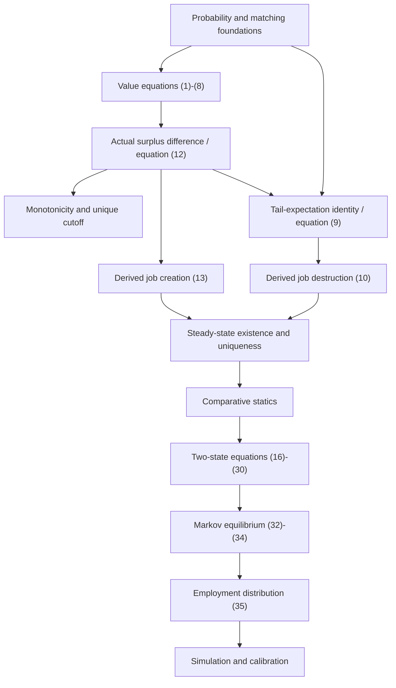

# Mortensen-Pissarides (1994): Theorem and Proof Progress Audit

Audit date: 2026-07-28  
Repository root: `/Users/davidxu/Documents/lean4tutorial`  
Lean source base: `Lean4Tutorial/i002_replicate_MP`  
Paper: `Lean4Tutorial/i002_replicate_MP/Mortensen-JobCreationJob-1994.pdf`

This audit groups the paper into economically meaningful theorem families. An equation is
not counted as proved merely because Lean can state it, a structure stores it, or a
separate closed-form function has the desired shape.

## 1. Executive summary

### Current result counts

There are **79 substantive theorem-level results** in this audit.

| Current formal status | Count | Interpretation |
|---|---:|---|
| **Proved faithfully** | **9** | A Lean theorem derives the intended claim from legitimate displayed prerequisites. |
| **Proved conditionally** | **6** | The proof is sound, but an economically important premise, restriction, or fixed-object comparison remains supplied. |
| **Encoded as a predicate or definition** | **8** | Lean can express the object or formula, but no theorem derives it. |
| **Assumed in a structure** | **11** | A purported equilibrium supplies the equation or ordering as a record field. |
| **Only an elementary supporting lemma exists** | **6** | Lean proves detached algebra/order facts, not the economic theorem. |
| **Finite-state witness only** | **0** | No concrete `Fin 2` or `Fin 3` equilibrium/calibration witness currently exists in Lean. |
| **Not formalized** | **33** | No corresponding substantive declaration or proof exists. |
| **Paper statement requires clarification or correction** | **6** | The claim needs sharper assumptions, endpoint conventions, or a weaker formal statement before proof. |

### Overall verdict

- **Representation is substantial:** the stationary value equations, principal reduced
  equations, anticipated-state formulas, Markov Bellman equation, and accounting
  identities can be stated in Lean.
- **Derivation is concentrated in supporting algebra:** the strongest current results are
  value-equation aggregation, zero-profit algebra, monotonicity of hazards/flows, and
  stationary accounting.
- **The core paper chain is not closed:** the actual `ValueEquilibrium.S` is not identified
  with `S_cutoff`; equations (10) and (13) are not jointly derived from the value system;
  existence, uniqueness, and shock comparative statics are not proved.
- **Quantitative replication has not started:** there is no concrete stochastic matrix,
  finite-state equilibrium witness, employment-distribution update, or simulation.

## 2. One-page high-level progress dashboard

Fractions in “representation” count family results with a current Lean declaration,
field, or supporting theorem. Fractions in “derivation” count faithful or conditional
substantive proofs; they deliberately exclude mere definitions, fields, and detached
elementary lemmas.

| # | Theorem family | Principal paper material | Representation | Derivation | Economic adequacy |
|---:|---|---|---:|---:|---|
| 1 | Model primitives and stochastic environment | pp. 398-400 | 3/4 | 0/4 | **Red:** probability process, moments, and atomlessness incomplete. |
| 2 | Value equations and Nash bargaining | (1)-(8), pp. 400-401 | 4/4 | 3/4 | **Amber-green:** encoded system is strong; paper probability closure is detached. |
| 3 | Surplus representation | (9), (12), pp. 401-402 | 3/5 | 0/5 | **Red:** closed form exists separately, not for actual equilibrium surplus. |
| 4 | Reservation productivity and job destruction | (9)-(10), pp. 401-402 | 2/4 | 1/4 | **Red:** equation (10) is supplied; cutoff atom convention unresolved. |
| 5 | Job-creation condition | (12)-(13), p. 402 | 3/4 | 2/4 | **Amber:** good closed-form algebra, missing actual value-equilibrium bridge. |
| 6 | Steady-state characterization | (10), (13), (14) | 4/4 | 2/4 | **Amber:** accounting is proved after the equilibrium equations are supplied. |
| 7 | Existence and uniqueness | p. 402 prose | 0/3 | 0/3 | **Red:** no witness, uniqueness theorem, or value-to-steady bridge. |
| 8 | Comparative statics | pp. 401-404, Appendix | 5/12 | 2/12 | **Red:** main equilibrium orderings are missing or hypotheses. |
| 9 | Beveridge curve and unemployment | (14)-(15), pp. 403-405 | 3/5 | 2/5 | **Amber:** flow identities are good; curve geometry and converse missing. |
| 10 | Two-state anticipated aggregate shocks | (16)-(30), pp. 405-408 | 5/8 | 2/8 | **Red-amber:** selected formulas represented; value derivation absent. |
| 11 | Two-state dispersion shocks | (31), pp. 408-409 | 0/3 | 0/3 | **Red.** |
| 12 | General Markov equilibrium | (32)-(34), p. 409 | 2/4 | 0/4 | **Red-amber:** equations are fields, no solution or statewise cutoff closure. |
| 13 | Employment-distribution dynamics | (35), p. 410 | 1/3 | 0/3 | **Red.** |
| 14 | Simulation accounting | (36)-(38), p. 410 | 5/6 | 1/6 | **Amber:** accounting is proved; model-generated path is absent. |
| 15 | Calibration and numerical replication | (39), (40), (42), Tables I-II | 0/4 | 0/4 | **Red.** |
| 16 | Appendix comparative-static derivations | (A1)-(A12), pp. 413-414 | 0/6 | 0/6 | **Red:** only a detached fixed-`θ` RHS sign lemma exists elsewhere. |

## 3. Status rules

- **Proved faithfully:** corresponding Lean theorem exists and derives the paper-level
  conclusion at appropriate generality.
- **Proved conditionally:** theorem exists, but a major economic premise or a restricted
  comparison is supplied.
- **Encoded as a predicate or definition:** formula/object exists but is not derived.
- **Assumed in a structure:** equation, cutoff rule, or ordering is a record field.
- **Only an elementary supporting lemma exists:** useful algebra/order result is detached
  from the economic model.
- **Finite-state witness only:** a concrete finite witness exists but no general theorem.
- **Not formalized:** no substantive Lean result.
- **Paper statement requires clarification or correction:** endpoint, regularity,
  universality, or numerical exactness must be repaired before proof.

Grades use **green**, **amber**, and **red** independently of the status label.

## 4. Theorem-level progress by family

### Family 1. Model primitives and stochastic environment

Principal paper claims: affine productivity, Poisson redraws, atomless standardized shock
law, upper-support entry, CRS matching, and endogenous separation hazard (pp. 398-400).

| ID | Theorem-style result | Paper statement and prerequisites | Lean correspondence | Status; derived or supplied | Missing work; grade |
|---|---|---|---|---|---|
| PP-01-01 | Affine job productivity | `y(ε)=p+σε`; scalar primitives. | `Primitives.price`, `Definitions.lean:64-66`. | **Encoded as a predicate or definition**; definitional. | Attach moment normalization before interpreting `σ` as SD; **amber**. |
| PP-01-02 | Poisson iid shock environment with standardized law | Rate `λ`, iid redraw `F`, no atoms, mean 0, variance 1, finite upper support. | Raw `λ,dF,εu`, `Definitions.lean:25-40`; partial fields `Definitions.lean:265-274`. | **Not formalized** as a process/law contract. | Bundle probability, atomlessness, moments, independence semantics; **red**. |
| PP-01-03 | CRS matching with strict elasticities | `q'<0`, elasticity in `(-1,0)`, so `θq(θ)` rises. | `mWorker,m`, `Definitions.lean:52-62`; weak fields `Definitions.lean:275-280`. | **Encoded as a predicate or definition**; desired strict properties not derived. | Matching-technology regularity and elasticity record; **amber-red**. |
| PP-01-04 | Threshold separation hazard | Jobs below cutoff separate at `λF(εd)`. | `destructionHazard`, `Definitions.lean:80-82`; reservation field `Equilibrium.lean:48-49`. | **Encoded as a predicate or definition**. | Atomless law or consistent `Iio` convention; **red**. |

### Family 2. Value equations and Nash bargaining

Principal material: equations (1)-(8), pp. 400-401.

| ID | Theorem-style result | Statement / prerequisites | Lean correspondence | Status; derived or supplied | Missing work; grade |
|---|---|---|---|---|---|
| PP-02-01 | Stationary value system satisfies (1)-(7) | Vacancy, firm, worker, unemployment Bellman equations, surplus identity, and Nash sharing. | Predicates `Definitions.lean:96-133`; fields `Equilibrium.lean:37-47`. | **Assumed in a structure**; all equations are supplied with `ValueEquilibrium`. | A stochastic-control derivation is optional, but probability/integrability semantics should be explicit; **amber**. |
| PP-02-02 | Equations (3)-(7) imply surplus equation (8) | Add firm and worker equations, subtract unemployment equation. | `ValueEquilibrium.surplus_bellman`, `Results.lean:24-38`. | **Proved conditionally** for the encoded Bellman predicates. | Attach mass-one/integrability closure so (5)-(6) exactly match the paper; **amber-green**. |
| PP-02-03 | Firm value is zero at the supplied cutoff | Surplus identity, Nash sharing, `S(εd)=0`. | `ValueEquilibrium.J_cutoff_eq_zero`, `Results.lean:40-47`. | **Proved faithfully**; conclusion derived from equilibrium fields. | No substantive gap for this conditional claim; **green**. |
| PP-02-04 | Free entry implies zero-profit value equation | `(1)-(2)` and `r>0` imply `q(θ)J(εu)=c`. | `ValueEquilibrium.vacancy_free_entry_value`, `Results.lean:49-62`. | **Proved faithfully**. | None beyond maintained `r>0`; **green**. |

### Family 3. Surplus representation

Principal material: integration-by-parts equation (9), affine surplus equation (12), and
the increasing-surplus cutoff argument, pp. 401-402.

| ID | Result | Statement / prerequisites | Lean correspondence | Status | Missing; grade |
|---|---|---|---|---|---|
| PP-03-01 | Closed-form cutoff surplus is expressible | `S_d(ε)=σ(ε-εd)/(r+λ)`. | `S_cutoff`, `Definitions.lean:84-86`. | **Encoded as a predicate or definition**. | Identify it with actual `ValueEquilibrium.S`; **amber**. |
| PP-03-02 | Closed-form surplus difference algebra | Difference of two `S_cutoff` values has slope `σ/(r+λ)`. | `surplus_difference`, `Results.lean:74-79`. | **Only an elementary supporting lemma exists**. | Prove the result for `E.S`; **amber**. |
| PP-03-03 | Actual equilibrium surplus satisfies equation (12) | `E.S ε-E.S εd=σ(ε-εd)/(r+λ)`. | No theorem; `E.S` at `Equilibrium.lean:33-34`. | **Not formalized**. | Subtract two instances of proved (8); **red**, critical blocker. |
| PP-03-04 | Increasing surplus yields a unique reservation cutoff | Strict increase, zero crossing, `S≥0 iff εd≤ε`. | `cutoff_zero` and `reservation_rule` fields, `Equilibrium.lean:48-49`. | **Assumed in a structure**. | Derive strict monotonicity and existence/uniqueness; **red**. |
| PP-03-05 | Positive-continuation expectation equals tail-CDF integral | Layer-cake/Stieltjes identity used in (9). | Separate integrals `Definitions.lean:68-78`; no bridge. | **Not formalized**. | Atomlessness/support/integrability plus specialized tail identity; **red**. |

### Family 4. Reservation productivity and job-destruction condition

Principal material: equations (9)-(10), cutoff uniqueness, and hazard response, pp. 401-402.

| ID | Result | Statement / prerequisites | Lean correspondence | Status | Missing; grade |
|---|---|---|---|---|---|
| PP-04-01 | Integrated surplus equation (9) | Bellman equation, affine surplus, tail identity. | None. | **Not formalized**. | PP-03-03 and PP-03-05; **red**. |
| PP-04-02 | Job-destruction condition (10) follows from values and free entry | Cutoff Bellman plus option value and zero profit. | Predicate `JobDestructionCondition`, `Definitions.lean:143-149`; field `Equilibrium.lean:64`. | **Assumed in a structure**. | Value-to-reduced derivation; **red**. |
| PP-04-03 | Higher cutoff weakly raises separation hazard | `λ≥0`, monotone CDF. | `destructionHazard_mono`, `Results.lean:109-114`. | **Proved faithfully** under maintained assumptions. | Strict version would require mass on intervals; **green** for weak claim. |
| PP-04-04 | Cutoff endpoint is consistent with destruction convention | Zero-surplus cutoff is not accidentally counted as destroyed. | `F` uses `Iic`, `Definitions.lean:48-50`; hazard `Definitions.lean:80-82`; weak acceptance `Equilibrium.lean:48-49`. | **Paper statement requires clarification or correction** in Lean's more general atomic setting. | Add atomlessness or use `Iio`; **red**. |

### Family 5. Job-creation condition

Principal material: equations (12)-(13) and the downward-sloping JC locus, p. 402.

| ID | Result | Statement / prerequisites | Lean correspondence | Status | Missing; grade |
|---|---|---|---|---|---|
| PP-05-01 | Job-creation condition (13) characterizes free entry | Actual `J(εu)`, Nash share, equation (12), positive gap. | Predicate `Definitions.lean:159-164`; field `Equilibrium.lean:65`. | **Assumed in a structure**. | Derive for actual `ValueEquilibrium`; **red**. |
| PP-05-02 | Closed-form (13) is equivalent to zero profit | Uses `J_cutoff`, sign assumptions, `εd<εu`. | `jobCreation_iff_freeEntryValue`, `Results.lean:121-145`. | **Proved conditionally** for the separate closed-form value. | Connect `E.J` to `J_cutoff`; **amber**. |
| PP-05-03 | JC locus slopes downward | Two points satisfying (13), ordered cutoffs, antitone `q`. | `jobCreationCurve_slopes_down`, `Results.lean:147-188`. | **Proved conditionally**. | Strict paper matching assumptions and joint-equilibrium context; **amber-green**. |
| PP-05-04 | Every suitable value equilibrium satisfies (13) | Bridge theorem. | None. | **Not formalized**. | PP-03-03 plus `vacancy_free_entry_value`; **red**. |

### Family 6. Steady-state equilibrium characterization

Principal material: equations (10), (13), and (14), pp. 401-404.

| ID | Result | Statement / prerequisites | Lean correspondence | Status | Missing; grade |
|---|---|---|---|---|---|
| PP-06-01 | Reduced equilibrium is a triple satisfying JD, JC, and Beveridge equations | `(θ,εd,u)` plus bounds. | `SteadyStateEquilibrium`, `Equilibrium.lean:53-66`. | **Assumed in a structure**; valid solution specification. | Construct it from values/existence theorem; **amber-red**. |
| PP-06-02 | Vacancy, employment, and gross flows are defined from a steady state | `v=θu`, `n=1-u`, creation/destruction formulas. | `Equilibrium.lean:72-83`. | **Encoded as a predicate or definition**. | Positivity/feasibility derivations; **amber**. |
| PP-06-03 | Stationary gross creation equals destruction | Equation (14), positive denominator. | `gross_flows_balance`, `Results.lean:337-351`. | **Proved faithfully** from the supplied steady-state equation. | None for the implication; **green**. |
| PP-06-04 | Stationary unemployment drift is zero | Flow balance and drift definition. | `unemploymentDrift_eq_zero`, `Results.lean:353-360`. | **Proved faithfully**. | None for the implication; **green**. |

### Family 7. Existence and uniqueness of equilibrium

Principal prose claim: equations (10) and (13) “uniquely determine” `θ` and `εd`, p. 402.

| ID | Result | Statement / prerequisites | Lean correspondence | Status | Missing; grade |
|---|---|---|---|---|---|
| PP-07-01 | A steady-state equilibrium exists | Continuity, domains, boundary crossing/coercivity. | No `Nonempty (SteadyStateEquilibrium P)` theorem. | **Not formalized**. | Residual functions and crossing hypotheses; **red**. |
| PP-07-02 | The joint steady state is unique | Strict JD/JC crossing. | No theorem. | **Paper statement requires clarification or correction** because global conditions are unstated. | Prove under explicit sufficient conditions or weaken to local uniqueness; **red**. |
| PP-07-03 | Value equilibrium induces reduced steady-state equilibrium | Derive (10),(13),(14) and bounds. | No bridge between `Equilibrium.lean:18-49` and `Equilibrium.lean:53-66`. | **Not formalized**. | Surplus/tail bridges, plus unemployment flow condition; **red**. |

### Family 8. Comparative statics

Principal material: pp. 401-404 and Appendix pp. 413-414.

| ID | Result | Statement / prerequisites | Lean correspondence | Status | Missing; grade |
|---|---|---|---|---|---|
| PP-08-01 | Higher aggregate productivity raises `θ` and lowers `εd` | Paired equilibria differing only in `p`. | No theorem; orderings appear as fields/hypotheses `Equilibrium.lean:96-98`, `Results.lean:310-314`. | **Not formalized**. | Existence/uniqueness and monotone crossing; **red**. |
| PP-08-02 | Given aggregate-shock orderings, creation rises and destruction falls | Same `u`, supplied `θ` and cutoff orders. | `aggregateShock_flow_orders`, `Results.lean:307-317`. | **Proved conditionally**; key conclusion supplied upstream. | Prove PP-08-01; **amber**. |
| PP-08-03 | Aggregate shock gives strict negative co-movement | Strict flow inequalities. | `aggregateShock_negative_comovement`, `Results.lean:378-386`. | **Only an elementary supporting lemma exists**; economic content is in hypotheses. | Genuine strict flow theorem; **red-amber**. |
| PP-08-04 | Higher unemployment income reverses the productivity comparison | Higher `b` lowers `θ` and raises `εd`. | No theorem. | **Not formalized**. | Paired equilibrium theorem varying only `b`; **red**. |
| PP-08-05 | Higher shock-arrival rate lowers cutoff and tightness | Appendix (A1)-(A4). | No derivative/comparison theorem. | **Not formalized**. | Tail bound and joint derivative/monotone proof; **red**. |
| PP-08-06 | Total destruction response to `λ` can be mitigated or reversed | Direct hazard effect versus cutoff response. | No theorem. | **Not formalized**. | Total derivative decomposition and sign conditions; **red**. |
| PP-08-07 | Higher discount rate lowers tightness | Appendix (A5)-(A7). | No theorem. | **Not formalized**. | Differentiable equilibrium branch; **red**. |
| PP-08-08 | Discount-rate effect on cutoff is ambiguous | Appendix (A8). | No theorem. | **Paper statement requires clarification or correction**. | Formula plus both-sign witnesses or conditional sign theorem; **red**. |
| PP-08-09 | Fixed-`θ` dispersion derivative has positive RHS under net-price condition | Equation (11) RHS only. | `dispersionCutoffResponse_pos`, `Results.lean:190-207`. | **Only an elementary supporting lemma exists**; no derivative equality. | FTC/IFT bridge; **amber-red**. |
| PP-08-10 | Higher dispersion raises equilibrium `θ` and, under a sufficient condition, `εd` | Appendix (A9)-(A12). | No ordering theorem. | **Not formalized**. | Moments, elasticity, IFT/monotone comparison; **red**. |
| PP-08-11 | Given dispersion orderings, creation and destruction both rise | Same `u`, supplied orders. | `dispersionShock_flow_orders`, `Results.lean:319-329`. | **Proved conditionally**. | Prove PP-08-10; **amber**. |
| PP-08-12 | Dispersion shock gives strict positive co-movement | Strict flow inequalities. | `dispersionShock_positive_comovement`, `Results.lean:388-396`. | **Only an elementary supporting lemma exists**. | Genuine strict equilibrium/flow theorem; **red-amber**. |

### Family 9. Beveridge curve and unemployment

Principal material: equations (14)-(15), pp. 403-405.

| ID | Result | Statement / prerequisites | Lean correspondence | Status | Missing; grade |
|---|---|---|---|---|---|
| PP-09-01 | Beveridge formula (14) holds in steady state | Solve zero inflow-outflow drift. | Predicate `Definitions.lean:214-218`; field `Equilibrium.lean:66`. | **Assumed in a structure**. | Derive from drift zero and denominator positivity; **amber-red**. |
| PP-09-02 | Beveridge denominator is positive | `θ>0`, hazard nonnegative, worker rate positive. | `beveridge_denominator_pos`, `Results.lean:284-289`. | **Proved faithfully**. | None; **green**. |
| PP-09-03 | Zero drift is equivalent to equation (14) | Both directions under positive denominator. | Only (14) -> zero drift is proved `Results.lean:337-360`. | **Not formalized** as equivalence. | Elementary converse; **red-amber**. |
| PP-09-04 | Beveridge curve slopes down when matching effect dominates | Paper explicitly adds a dominance assumption. | No declaration. | **Paper statement requires clarification or correction** into an exact inequality. | Formal derivative/dominance condition; **red**. |
| PP-09-05 | Unemployment rises iff destruction exceeds creation | Drift definition. | `unemploymentDrift_pos_iff`, `Results.lean:398-405`. | **Proved faithfully**. | Dynamic path interpretation remains separate; **green**. |

### Family 10. Two-state anticipated aggregate shocks

Principal material: equations (16)-(30), pp. 405-408.

| ID | Result | Statement / prerequisites | Lean correspondence | Status | Missing; grade |
|---|---|---|---|---|---|
| PP-10-01 | Two-state value equations (16)-(18) | Low/high surplus with Poisson switching and regional destruction. | Only general Markov Bellman field `Equilibrium.lean:169-176`. | **Not formalized** as the two-state/regional system. | `Fin 2` specialization and reservation rules; **red**. |
| PP-10-02 | Anticipated boom/recession destruction conditions (20),(24) | Derived from integrated state values. | Predicates `Definitions.lean:166-193`; fields `Equilibrium.lean:124-127`. | **Assumed in a structure**. | Derive equations (19)-(24); **red**. |
| PP-10-03 | Boom surplus formula (29) | Weighted high-state formula. | `boomSurplus`, `Definitions.lean:195-201`. | **Encoded as a predicate or definition**. | Identify with actual state surplus; **amber-red**. |
| PP-10-04 | Boom job-creation equation (30) | Free entry using boom surplus. | Predicate `Definitions.lean:203-212`; field `Equilibrium.lean:131-132`. | **Assumed in a structure**. | Derive from actual state value; **red**. |
| PP-10-05 | With zero aggregate transition, (30) equals (13) | Set `μ=0`. | `boomJobCreation_zero_transition_iff`, `Results.lean:209-220`. | **Proved faithfully** as formula consistency. | None; **green**. |
| PP-10-06 | Positive anticipation lowers boom tightness at fixed cutoffs | Positive denominator, ordered cutoffs, fixed candidate solutions. | `anticipation_reduces_boom_tightness`, `Results.lean:222-282`. | **Proved conditionally**. | Endogenous cutoff response and equilibrium existence; **amber**. |
| PP-10-07 | Anticipation narrows the boom-recession cutoff gap and dampens creation cyclicality | Endogenous two-state comparison. | No theorem. | **Not formalized**. | Two-state solution and response to `μ`; **red**. |
| PP-10-08 | Downturn destruction is dynamically more abrupt than upturn destruction | Employment mass between cutoffs and path dynamics. | Only detached arithmetic `Results.lean:414-427`. | **Not formalized** at economic level. | Employment-distribution transition and matched events; **red**. |

### Family 11. Two-state dispersion shocks

Principal material: equation (31) and prose, pp. 408-409.

| ID | Result | Lean correspondence | Status | Missing; grade |
|---|---|---|---|---|
| PP-11-01 | A high/low-dispersion anticipated equilibrium exists and has the paper's orderings. | None. | **Not formalized**. | Dispersion-specific two-state value system; **red**. |
| PP-11-02 | Direct creation effect dominates cutoff effect, equation (31). | None. | **Not formalized**. | Appendix dispersion theorem and equation (13); **red**. |
| PP-11-03 | Dispersion transitions create same-direction flows and asymmetric destruction. | Only generic conditional flow lemma `Results.lean:319-329`. | **Not formalized**. | State solution plus employment dynamics; **red**. |

### Family 12. General Markov equilibrium

Principal material: equations (32)-(34), p. 409.

| ID | Result | Lean correspondence | Status | Missing; grade |
|---|---|---|---|---|
| PP-12-01 | State-contingent free entry, cutoff zero, and Bellman equation characterize a Markov value equilibrium. | Fields `GeneralMarkovValueEquilibrium`, `Equilibrium.lean:146-176`. | **Assumed in a structure**. | Existence/construction and equivalence to paper integrals; **amber-red**. |
| PP-12-02 | A reduced equilibrium and stochastic kernel are representable over general states. | `MarkovEquilibrium`, `Equilibrium.lean:136-142`. | **Encoded as a predicate or definition**. | It does not impose (32)-(34); **amber**. |
| PP-12-03 | A Markov equilibrium exists/has a solution | Paper says an equilibrium is a solution of three functions. | None. | **Not formalized**. | Finite witness first; general fixed-point theorem later; **red**. |
| PP-12-04 | Lean's full-support `max` integral equals the paper's truncated current-state integral | Requires statewise reservation rule/support. | No theorem; missing fields in `Equilibrium.lean:156-176`. | **Paper statement requires clarification or correction** in current interface. | Statewise sign rule and integrability; **red**. |

### Family 13. Employment-distribution dynamics

Principal material: equation (35), p. 410.

| ID | Result | Lean correspondence | Status | Missing; grade |
|---|---|---|---|---|
| PP-13-01 | Employment is represented by a finite measure/density whose mass is total employment. | No path distribution; arbitrary integrand in `Definitions.lean:236-239`. | **Not formalized**. | Measure-valued state and mass invariant; **red**. |
| PP-13-02 | Employment distribution obeys transition law (35) | Survival, redraw, cutoff truncation. | None. | **Not formalized**. | Measure update, then density specialization; **red**. |
| PP-13-03 | One-off scrapping mass between cutoffs is expressible | Integral of arbitrary `n`. | `immediateScrapping`, `Definitions.lean:236-239`. | **Encoded as a predicate or definition**. | Nonnegative employment measure, ordered cutoffs, path connection; **amber-red**. |

### Family 14. Simulation accounting

Principal material: equations (36)-(38), p. 410.

| ID | Result | Lean correspondence | Status | Missing; grade |
|---|---|---|---|---|
| PP-14-01 | Period creation obeys (36) | Definition plus `SimulationPath.creation_law`, `Definitions.lean:232-234`, `Equilibrium.lean:194-195`. | **Assumed in a structure**. | Link `a_t` to Markov equilibrium and impose bounds; **amber**. |
| PP-14-02 | Period destruction obeys full (37) | Additive definition and field, `Definitions.lean:241-243`, `Equilibrium.lean:196-197`. | **Assumed in a structure**; ongoing term is arbitrary. | Exact ongoing hazard term and employment distribution; **red**. |
| PP-14-03 | Employment change equals creation minus destruction, (38) | `employment_change_identity` and path theorem, `Results.lean:407-436`. | **Proved faithfully** as accounting. | Derive path laws from model dynamics for economic closure; **green**. |
| PP-14-04 | Positive immediate scrapping raises destruction above ongoing component | `downturn_destruction_exceeds_ongoing`, `Results.lean:414-421`. | **Only an elementary supporting lemma exists**. | Derive positive scrapping from cutoffs and employment mass; **amber**. |
| PP-14-05 | Boom has no immediate scrapping term | `boom_without_scrapping`, `Results.lean:423-427`. | **Only an elementary supporting lemma exists**; zero is inserted. | Derive zero from transition direction; **amber**. |
| PP-14-06 | Simulated paths remain economically feasible | `0≤N≤1`, nonnegative flows. | No fields/theorems in `Equilibrium.lean:181-199`. | **Not formalized**. | Positivity and invariant-region theorem; **red**. |

### Family 15. Calibration and numerical replication

Principal material: equations (39), (40), (42), Table I, and Table II, pp. 411-412.
The paper visibly skips equation number (41); no result is invented for it.

| ID | Result | Lean correspondence | Status | Missing; grade |
|---|---|---|---|---|
| PP-15-01 | Matrix (39) is a valid three-state stochastic transition matrix. | No concrete `Fin 3` matrix. | **Not formalized**. | Exact matrix and row-stochastic proof; **red**. |
| PP-15-02 | Matching calibration satisfies equation (40). | No calibrated matching function. | **Not formalized**. | Distinct matching-elasticity notation and derivation from (32); **red**. |
| PP-15-03 | Reported vectors (42) solve (32)-(34). | No finite-state witness. | **Not formalized**; **Finite-state witness only count remains zero**. | Certified interval/residual witness; **red**. |
| PP-15-04 | Simulation reproduces reported moments and correlations. | No solver, RNG, statistics, or data. | **Not formalized**. | Reproducible calibration/simulation protocol; **red**. |

### Family 16. Appendix comparative-static derivations

Principal material: equations (A1)-(A12), pp. 413-414.

| ID | Result | Lean correspondence | Status | Missing; grade |
|---|---|---|---|---|
| PP-16-01 | A1-A3 yield derivatives of cutoff/tightness with respect to `λ`. | None. | **Not formalized**. | Differentiable residual system and algebra; **red**. |
| PP-16-02 | Tail bound (A4) controls the `λ` signs. | No interval-integral bound theorem. | **Not formalized**. | Elementary interval-integral monotonicity; **red-amber**. |
| PP-16-03 | A5-A7 yield a negative tightness response to `r`. | None. | **Not formalized**. | IFT/derivative identities; **red**. |
| PP-16-04 | A8 leaves the cutoff response to `r` ambiguous. | None. | **Paper statement requires clarification or correction**. | Formula plus sign-conditional theorem or both-sign witnesses; **red**. |
| PP-16-05 | A9-A10 give the joint dispersion derivative system. | Current RHS definition is only fixed-`θ`, `Definitions.lean:151-157`. | **Not formalized**. | FTC/IFT and residual derivatives; **red**. |
| PP-16-06 | A11-A12 imply `θ` rises with `σ`, and `p≥b` suffices for cutoff rise. | Flow theorem assumes orders `Results.lean:319-329`. | **Not formalized**. | Mean-zero law, elasticity, solved derivative signs; **red**. |

## 5. What is actually proved today?

### Faithful substantive proofs

1. Firm value is zero at the supplied zero-surplus cutoff
   (`ValueEquilibrium.J_cutoff_eq_zero`, `Results.lean:40-47`).
2. Vacancy Bellman plus free entry imply `q(θ)J(εu)=c`
   (`ValueEquilibrium.vacancy_free_entry_value`, `Results.lean:49-62`).
3. A higher cutoff weakly raises the separation hazard
   (`destructionHazard_mono`, `Results.lean:109-114`).
4. Equation (14), when supplied, implies balanced gross flows
   (`gross_flows_balance`, `Results.lean:337-351`).
5. The same supplied steady state has zero unemployment drift
   (`unemploymentDrift_eq_zero`, `Results.lean:353-360`).
6. The Beveridge denominator is positive at positive tightness
   (`beveridge_denominator_pos`, `Results.lean:284-289`).
7. Unemployment drift is positive iff destruction exceeds creation
   (`unemploymentDrift_pos_iff`, `Results.lean:398-405`).
8. Setting aggregate transition intensity to zero reduces (30) to (13)
   (`boomJobCreation_zero_transition_iff`, `Results.lean:209-220`).
9. Employment changes by creation minus destruction
   (`employment_change_identity` and `SimulationPath.employment_change`,
   `Results.lean:407-436`).

### Conditional substantive proofs

- encoded equations (3)-(7) imply encoded (8)
  (`ValueEquilibrium.surplus_bellman`, `Results.lean:24-38`);
- the closed-form equation (13) is equivalent to closed-form zero profit
  (`jobCreation_iff_freeEntryValue`, `Results.lean:121-145`);
- the JC locus slopes down for supplied points satisfying (13)
  (`jobCreationCurve_slopes_down`, `Results.lean:147-188`);
- supplied aggregate/dispersion equilibrium orderings imply weak flow orderings
  (`Results.lean:307-329`);
- anticipation lowers boom tightness only in the theorem's fixed-cutoff comparison
  (`anticipation_reduces_boom_tightness`, `Results.lean:222-282`).

## 6. What is currently only assumed or represented?

- All value equations (1)-(7) are fields of `ValueEquilibrium`
  (`Equilibrium.lean:37-47`).
- The zero cutoff and reservation rule are fields, not derived consequences
  (`Equilibrium.lean:48-49`).
- Equations (10), (13), and (14) are fields of `SteadyStateEquilibrium`
  (`Equilibrium.lean:64-66`).
- The boom/recession tightness and cutoff orderings are fields of
  `TwoStateEquilibrium` (`Equilibrium.lean:96-98`).
- Equations (20), (24), recession (13), and boom (30) are fields of
  `AnticipatedTwoStateEquilibrium` (`Equilibrium.lean:124-132`).
- Equations (32)-(34) are fields of `GeneralMarkovValueEquilibrium`
  (`Equilibrium.lean:161-176`).
- Equations (36)-(38) are path laws supplied to `SimulationPath`, whose primitive
  parameter is otherwise unused (`Equilibrium.lean:181-199`).
- `S_cutoff` and `boomSurplus` are formulas, not theorems about actual equilibrium surplus
  (`Definitions.lean:84-94`, `Definitions.lean:195-201`).
- The strict co-movement theorems are generic sign arithmetic with the desired flow
  inequalities already present as hypotheses (`Results.lean:378-396`).

## 7. Dependency-ordered roadmap

### Blocking theorem by downstream family

| Downstream family | Immediate blocker |
|---|---|
| Actual cutoff and reservation theorem | Actual equation (12) for `ValueEquilibrium.S`. |
| Actual job creation (13) | Equation (12) plus actual Nash share at `εu`. |
| Job destruction (10) | Tail-expectation identity and integrated equation (9). |
| Steady-state existence/uniqueness | Derived JD/JC residuals plus continuity/boundary conditions. |
| Aggregate/dispersion comparative statics | Existence/uniqueness or a local nonsingular equilibrium branch. |
| Two-state anticipated system | Statewise reservation/surplus representation and equations (16)-(18). |
| Markov solution | Statewise analytic closure and a finite/general existence method. |
| Dynamics/calibration | Employment-measure equation (35) and a concrete finite-state equilibrium witness. |

## 8. Candidate first milestones compared

| Candidate | Already available | New infrastructure | Genuine progress / unlocks | Circularity risk | Difficulty | Verdict |
|---|---|---|---|---|---|---|
| Complete probability/CDF foundation | `dF`, support and mass fields; Mathlib probability/NoAtoms tools | Bundled probability, atomlessness, moments, derived CDF lemmas | Fixes cutoff atom issue and enables tail/Appendix work, but does not itself prove a headline equilibrium result | Low | **Moderate-foundational** | Essential, but not the highest immediate theorem gain. |
| Derive equation (8) fully from (5)-(7) | Existing theorem `Results.lean:24-38` | Clarify mass-one/integrability or restate integrals of differences | Mostly strengthens an already proved edge | Low | **Elementary-moderate** | Important cleanup, not the best new milestone. |
| Derive equation (12) for actual `ValueEquilibrium.S` | Proved (8), affine `price`, `r+λ>0`, cutoff-zero field | None for the surplus-difference theorem | First missing headline theorem; unlocks actual JC bridge, monotonicity, and cutoff work | Low if first proving differences; moderate if claiming cutoff existence from supplied field | **Elementary** | **Best first milestone.** |
| Derive equation (10) | JD predicate and tail integral definitions | Actual (12), tail identity, atomlessness/integrability | Major result and critical bridge | High if option-value identity is assumed rather than proved | **Foundational** | Too early. |
| Construct `ValueEquilibrium -> SteadyStateEquilibrium` | Both records exist | Derived (10), (13), unemployment condition, bounds | Closes the central architecture | Very high if record fields are merely copied in | **Foundational** | End goal of the first proof phase, not first step. |

### Is equation (12) genuinely best?

Yes, but the correct first theorem is the **surplus-difference statement for the actual
`E.S`**, not merely another lemma about `S_cutoff`.

It dominates the alternatives because:

- it uses the existing proved surplus Bellman equation and only algebra;
- continuation integrals cancel, so probability/integrability infrastructure is not
  needed for this step;
- it creates genuine economic theorem progress rather than a representation;
- it immediately enables the actual equation (13) bridge;
- it is logically upstream of equation (10) and the value-to-steady-state bridge;
- it does not assume the comparative-static or existence conclusion it seeks to prove.

The probability/CDF foundation should follow soon after, before any tail-integral,
cutoff-atom, or derivative proof.

## 9. First three implementation milestones

### Milestone 1 - Actual surplus difference, equation (12)

- **Exact result:** for `A : Assumptions P` and `E : ValueEquilibrium P`,
  `E.S ε₂-E.S ε₁=P.σ*(ε₂-ε₁)/(P.r+P.λ)`.
- **Available dependencies:** `E.surplus_bellman` (`Results.lean:24-38`), affine price
  (`Definitions.lean:64-66`), positivity of `r+λ`.
- **New infrastructure:** none.
- **Unlocks:** `E.S ε=P.S_cutoff E.εd ε`, strict surplus monotonicity, actual equation
  (13), and cutoff uniqueness work.
- **Circularity risk:** low. Prove the two-point difference before using the supplied
  `cutoff_zero`; do not use `reservation_rule`.
- **Difficulty:** **elementary**.

### Milestone 2 - Actual value-equilibrium job-creation condition

- **Exact result:** every suitable `ValueEquilibrium` satisfies
  `P.JobCreationCondition E.θ E.εd`.
- **Available dependencies:** Milestone 1, `vacancy_free_entry_value`,
  `surplus_identity`, `nash_sharing`, and existing closed-form algebra
  (`Results.lean:49-62`, `Results.lean:121-145`).
- **New infrastructure:** none.
- **Unlocks:** one half of the `ValueEquilibrium -> SteadyStateEquilibrium` bridge and a
  faithful basis for JC comparative statics.
- **Circularity risk:** low if `E.job_creation` is not imported from a reduced equilibrium.
- **Difficulty:** **elementary-moderate**.

### Milestone 3 - Paper probability/CDF foundation

- **Exact result:** introduce a paper shock-law contract and derive CDF bounds,
  monotonicity, endpoint equality under atomlessness, and required moment facts.
- **Available dependencies:** `dF`, `F`, upper-support field; Mathlib probability and
  `NoAtoms` infrastructure.
- **New infrastructure:** bundled probability measure, atomlessness, integrability,
  mean-zero and second-moment normalization.
- **Unlocks:** tail identity, equation (9), equation (10), cutoff consistency, equation
  (11), and Appendix derivations.
- **Circularity risk:** low; these are primitive/analytic facts, not equilibrium
  conclusions.
- **Difficulty:** **moderate-foundational**.

The next milestone after these three is the specialized tail-expectation identity, followed
immediately by the derived job-destruction condition (10).

## 10. Three most important missing bridges

1. **Actual-surplus bridge:** `ValueEquilibrium.S` to equation (12) and `S_cutoff`.
2. **Option-value bridge:** expected positive continuation to the tail-CDF integral,
   enabling equations (9) and (10).
3. **Solution bridge:** derived JD/JC/Beveridge equations to existence and uniqueness of a
   `SteadyStateEquilibrium`, enabling genuine comparative statics.

## 11. Recommended next proof milestone

Prove the two-point surplus-difference form of **equation (12) for the actual
`ValueEquilibrium.S`**.

This recommendation is not automatic: it follows from comparing all five plausible
starting points. The probability foundation is more foundational but yields less immediate
theorem progress; equation (8) is already substantially proved; equation (10) depends on
missing measure theory; and the full value-to-steady bridge would be circular if attempted
before deriving its fields. Actual equation (12) is elementary, upstream, noncircular, and
unlocks the largest amount of sound downstream work per unit of new infrastructure.
